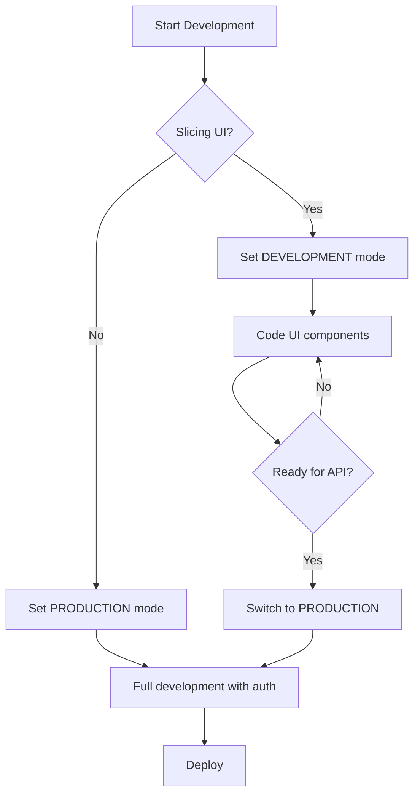

# App Mode Switch - Dokumentasi

Sistem mode aplikasi untuk memudahkan proses development dan slicing UI.

## 🎯 Tujuan

- **DEVELOPMENT MODE**: Untuk proses slicing UI tanpa perlu autentikasi
- **PRODUCTION MODE**: Mode normal dengan sistem autentikasi lengkap

## 🔧 Cara Penggunaan

### 1. Switch Mode

Edit file `src/config/app-mode.ts`:

```typescript
// Untuk slicing (development)
export const APP_MODE: AppMode = 'DEVELOPMENT' as AppMode;

// Untuk production
export const APP_MODE: AppMode = 'PRODUCTION' as AppMode;
```

### 2. Menggunakan di Komponen

```vue
<script setup>
import { useAppMode } from '~/composables/useAppMode';

const { isSlicingMode, getAuthState, handleAuthAction } = useAppMode();

// Cek mode
if (isSlicingMode) {
  console.log('Sedang dalam mode slicing');
}

// Get auth state (mock di slicing mode)
const { isAuthenticated, user } = getAuthState();

// Handle action yang butuh auth
const handleLogin = () => {
  handleAuthAction('login', () => {
    // Logic login sebenarnya (hanya jalan di production mode)
    authStore.login();
  });
};
</script>
```

### 3. Di Header/Navigation

```vue
<template>
  <!-- Otomatis menampilkan UI authenticated state di slicing mode -->
  <div v-if="isAuthenticated">
    <p>Selamat datang, {{ user?.name }}</p>
  </div>
</template>

<script setup>
const { getAuthState } = useAppMode();
const { isAuthenticated, user } = getAuthState();
</script>
```

## 🎨 Fitur Slicing Mode

### Yang Dimatikan:
- ✅ Authentication middleware
- ✅ Route protection
- ✅ Login/logout functionality
- ✅ API calls untuk auth

### Yang Tetap Jalan:
- ✅ UI components
- ✅ Navigation
- ✅ Layout rendering
- ✅ Styling
- ✅ Mock data untuk testing UI

### Mock Data Available:
```typescript
{
  id: 1,
  name: 'John Doe',
  email: 'john@example.com',
  user_group_id: '03', // Pelamar
  avatar: null,
}
```

## 📁 File yang Terpengaruh

- `src/config/app-mode.ts` - Konfigurasi utama
- `src/middleware/auth.global.ts` - Middleware auth
- `src/composables/useAppMode.ts` - Helper composable
- `src/components/common/layouts/HeaderPublic.vue` - Header navigation

## 🚀 Quick Start

1. **Untuk Slicing**: Set `APP_MODE = 'DEVELOPMENT'`
2. **Untuk Testing API**: Set `APP_MODE = 'PRODUCTION'`
3. Restart dev server
4. Lihat console untuk konfirmasi mode

## 🔍 Debug

Mode akan di-log di browser console:
- 🎨 **SLICING MODE**: Authentication disabled
- 🔒 **PRODUCTION MODE**: Full authentication enabled

## ⚠️ Important Notes

1. **Jangan lupa** ubah ke `PRODUCTION` sebelum deploy
2. **Mode ini hanya untuk development**, jangan digunakan di production
3. **Restart server** setelah mengubah mode
4. **Check console** untuk memastikan mode yang aktif

## 🔄 Workflow


